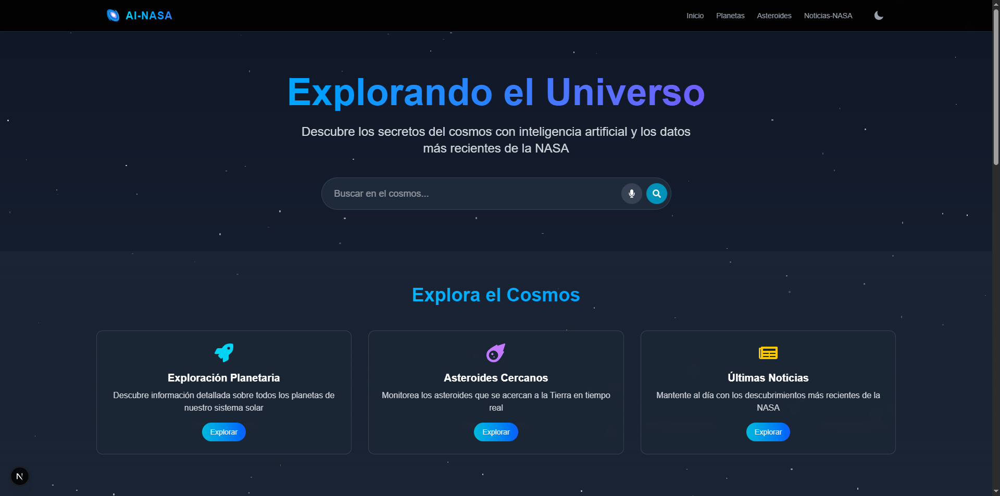
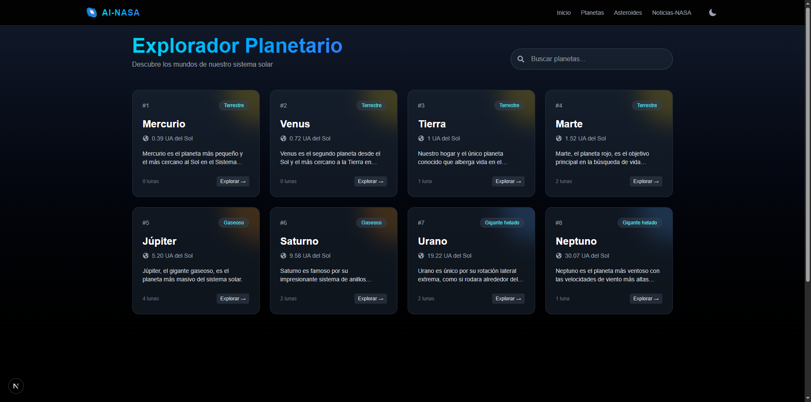
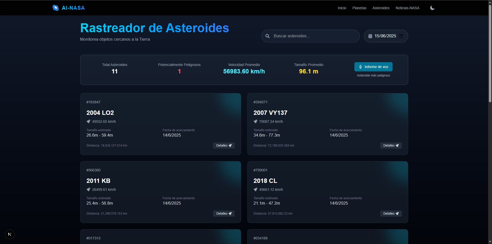
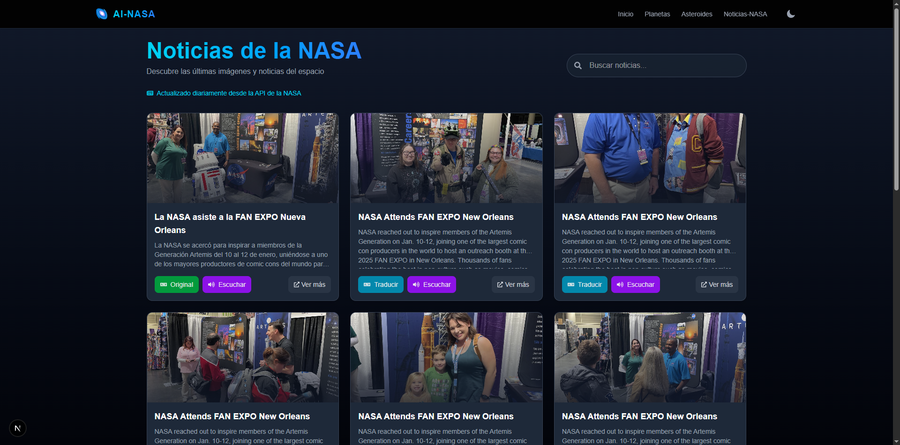

# 🌌 Proyecto: Explorador del Universo con Voz e Inteligencia Artificial

Este proyecto es una plataforma web interactiva que permite explorar el universo utilizando comandos de voz. Aprovechamos la **API de la NASA** y la **Web Speech API** para brindar una experiencia futurista e inmersiva.

---

## 👨‍🚀 Características Principales

- 🔭 Consultar datos astronómicos desde la API de la NASA.
- 🎙️ Reconocimiento de voz con comandos como:
  - `Dame información de Marte`
  - `Noticias relevantes de hoy`
  - `Los asteroides más peligrosos`
  - `Ve a planetas`, `Ir a noticias`, `Volver al inicio`, etc.
- 🧠 Navegación e interacción controladas por voz con botones tipo "🎤 Reconocimiento de voz".
- 🧩 Arquitectura modular basada en microservicios:
  - Componentes reutilizables (`components/`)
  - Hooks personalizados (`hooks/`)
  - Librerías auxiliares (`lib/`)
  - Gestión de estado con Redux (`store/`)
  - Middleware para flujos de lógica
- 🛰️ Información en tiempo real desde múltiples endpoints de la NASA.

---

## 🛠️ Tecnologías Usadas

| Tecnología | Logo |
|-----------|------|
| Next.js |  |
| React |  |
| TypeScript |  |
| Tailwind CSS |  |
| Docker |  |
| MySQL |  |
| Redux Toolkit |  |
| Web Speech API | 🎤 (API nativa del navegador) |
| API de la NASA | 🪐 https://api.nasa.gov |

---

## 📁 Estructura del Proyecto (Demo)

```
/src
  /app
    /planetas
    /noticias
    /asteroides
  /components
  /hooks
  /store
  /middleware
  /lib
  /styles
  /assets
```

---

## 👥 Equipo de Desarrollo

- **Amaury Yamil**
- **Jose Perez**

---

## 📷 Espacio para Imágenes de Demostración

1. 
2. 
3. 
4. 
5. 

---

## 🚀 Instalación Rápida

```bash
git clone https://github.com/Perezcortes/ai-nasa.git
cd ai-nasa
npm install
npm run dev
```

---

## 🧠 Comandos de Voz Soportados

- `Dame información de Júpiter`
- `Ir a noticias`
- `Mostrar asteroides peligrosos`
- `Regresar al inicio`
- `Leer las noticias de hoy`
- `¿Qué misiones hay activas?`

---

## 📦 Consideraciones Adicionales

- Reconocimiento de voz optimizado para español.
- Diseño responsivo y futurista con Tailwind CSS.
- Compatibilidad con navegadores modernos.
- Listo para producción con Docker y despliegue en plataformas como Vercel o Railway.

---

## 📄 Licencia

MIT
